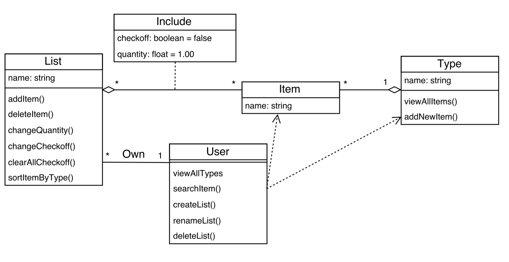

# Design 1

*PROs*
All the methods mentioned in the requirements are realized in the design.
It is a good idea to have the attributes allLists within GroceryListsHandler and itemList within GroceryList.

*CONs*
Use of local files to save lists complicates design, rather than just using same DB as items/item types
The relationship between Item and ItemType is more like aggregation, rather than association.
It will be better if the attribute quantity is a float type, not an int.

# Design 2

*PROs*
Use of database to save lists makes for consistent data storage model.
check/uncheck function inside GroceryListEntry is better place than in GroceryList
Entry as a junction between list and item is a good idea.
It is a good idea to have the attributes groceryLists within GroceryListsController and list within GroceryList.
Adding the attribute unit within GroceryListEntry is a good idea.

*CONs*
Specification of a specific software package (Hibernate) in design seems more of a ‘how’ than ‘what’ discussion and perhaps too detailed/limiting for the design document.
How lists are saved automatically is not immediately clear
The classes ItemType and Item are not explained in design-information. 
The methods searchItemName and addNewItem are not included in the design diagram.

# Design 3

*PROs*
Use of database to save lists makes for consistent data storage model.
The include association between the item and groceryList is pretty powerful and sets up the design to be extendable for future features that could be added, we wouldn’t need to fit them in an item or the groceryList.

*CONs*
Some names are not intuitive. Include? Users?
The changeCheckoff() functionality should either take in an item, or be in the Item object as we can check off individual items.

# Design 4

*PROs*
GroceryList class good model for requirements
ItemSelection is good model of Item/GroceryList association
dataBase class models DB at a nice level of abstraction for this diagram
The inclusion of unit as an attribute of itemSelection is a good idea.

*CONs*
Selecting/Accessing of lists seems like it would need to be outside of the GroceryLIst class itself, since GroceryList instances would each represent only one list, not all of them.
user IDs / user tracking is not needed for requirements
The design does not include the class of Type, which should be stored in the database.
The groceryList requires to be associated with an item, which doesn’t seem right, we should be able to have an empty groceryList.

# Team Design

The four designs had many similarities in fundamental structure. Common themes of classes to represent items, item types, grocery lists, grocery list entries and a list handler class of some type. There were differences in the representation and associations of these classes between the designs. Some had an association class to represent the grocery list entries, while others showed it as a separate class. The exact class a function was located in also varied between designs.

The core decisions to use Item, ItemType, GroceryList, GroceryListEntry, and a GroceryList aggregation/handler classes allow the design to match the objects requirements for this project.

Most designs saved the grocery lists in the same database as the items. It was decided that storing all data into one database would simplify the design while meeting all requirements for persistence and saving state.

We decided to add the attribute Unit in GroceryListEntry.

# Summary
Being able to identify similar ideas with different representations is a critical first step to begin comparing different designs. There are not only many ways to solve a problem, there are many ways to describe a single solution to a problem or even very similar solutions.

When trying to make a design change in one class or area, what may seem like a great solution could make another area of design not work as well. It can be difficult to keep the entire picture in mind at once while considering changes. This seems to speak to the need to compartmentalize or use object oriented principles to reduce dependencies between classes.
