# Design Document - v2.0
**Author**: Team39

## 1 Design Considerations
### 1.1 Assumptions
Internet connection may not be available. Sufficient screen size to interact with application. User is familiar with grocery shopping and grocery lists.

### 1.2 Constraints
Local storage only for storage of lists and items, due to no internet connection assumption. Development time frame is limited to only 3 weeks.

### 1.3 System Environment
Requires Android software API 19 or greater running on Android phone or tablet device.

## 2 Architectural Design
### 2.1 Component Diagram
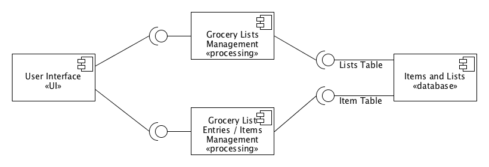

There are 4 components in the Grocery List Manager application design. The user interface component interfaces directly with the 2 core processing components, which manage the Grocery Lists and Entries within individual lists. Finally, the Item and Lists component represents the database, which contains all items, item types, and grocery lists information.

### 2.2 Deployment Diagram
This diagram is unnecessary due to the fact that all components will exist on a single Android device.

## 3 Low-Level Design
### 3.1 Class Diagram
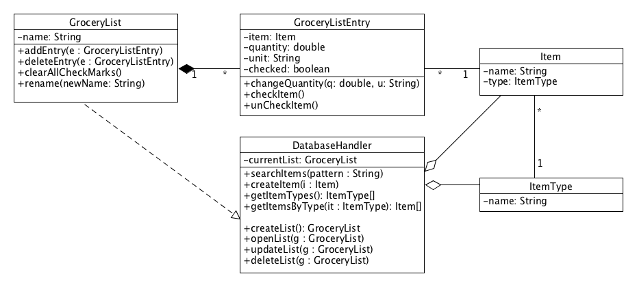
The core class of the design in GroceryList. This class contains all information about each list within the application. It contains multiple GroceryListEntry class instances, which describes each entry within a grocery list. Each GroceryListEntry contains an Item class instance. The Item class contains ItemType instance. Items, ItemTypes, GroceryLists, and GroceryListEntries are stored in a database. The interface to the database is represented by the DatabaseHandler class. 

### 3.2 Other Diagrams
Entity Relationship Diagram
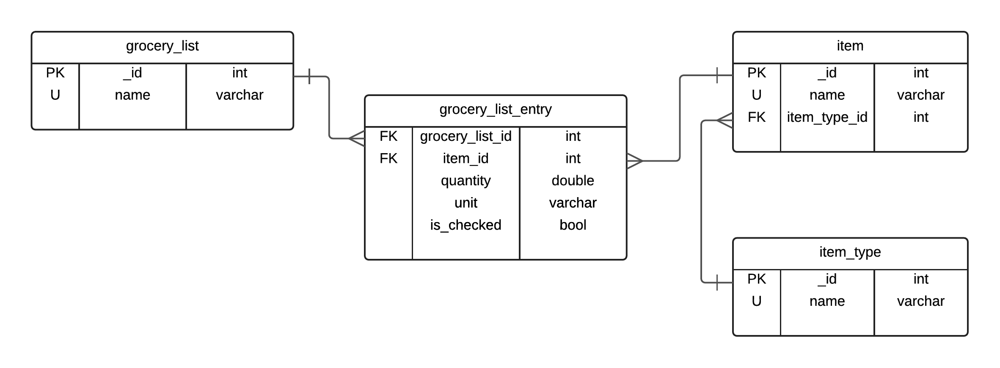
Diagram showing the database structure and relationships.

## 4 User Interface Design

### Grocery List GUI
#### View
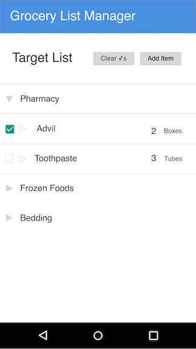 
#### Search/Add Item
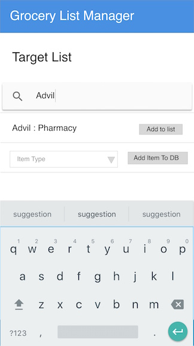 
#### Change Quantity
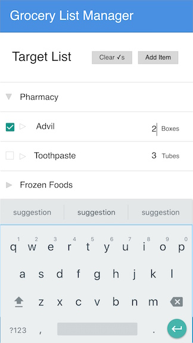
#### Delete Items
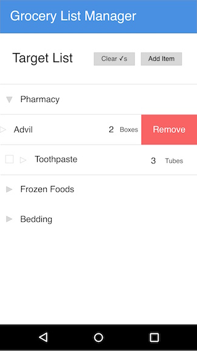

### List Manager GUI
#### View
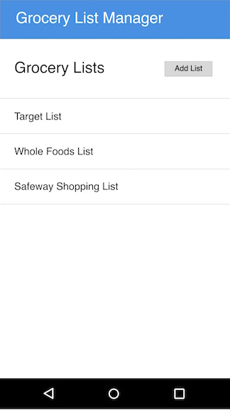
#### Add List
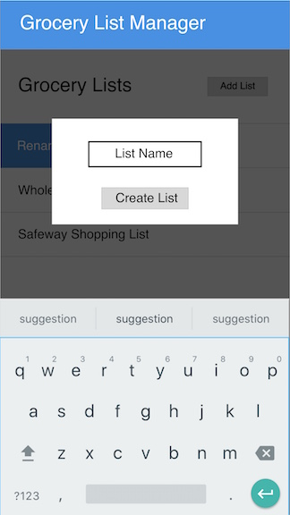
#### Rename List
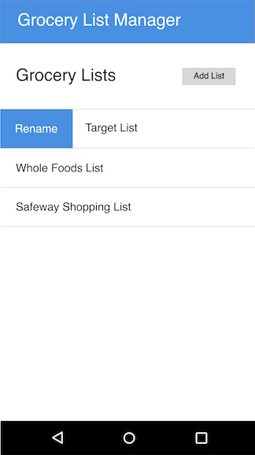
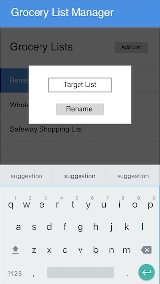
#### Delete List
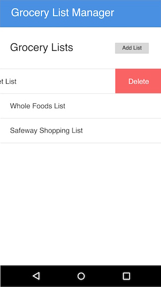
