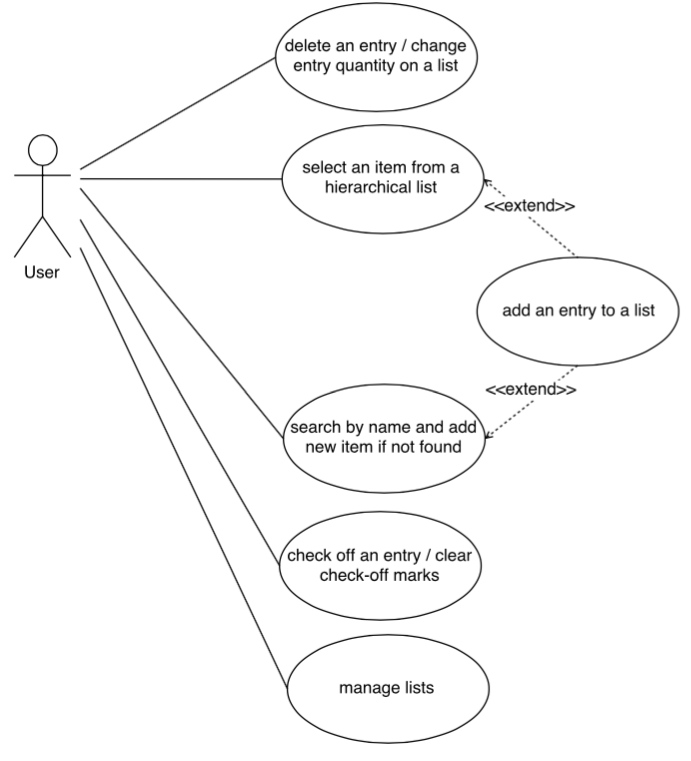

# Use Case Model - v2.0
**Author**: Team39

## 1 Use Case Diagram

## 2 Use Case Descriptions
### delete an entry / change entry quantity on a list
##### Requirements
The user deletes an entry from a list or changes the quantity of an entry.
##### Pre-conditions
One list is selected and all the entries in the list are presented to the user. 
##### Post-conditions
The modified list is saved.
##### Scenarios
* The user clicks ¡°delete¡± button next to an entry. The entry is deleted from the list.
* The user clicks ¡°modify¡± button next to an entry. A new window pops up and the user enters new quantity or a new quantity unit and clicks ¡°save¡±. If invalid input, display an error message. If the user clicks ¡°cancel¡±, no changes are made.
* The app presents the updated list to the user.

### add an entry to a list
##### Requirements
The user adds an entry to one selected list and specify the quantity.
##### Pre-conditions
One list is selected and one item is selected. 
##### Post-conditions
The modified list is saved.
##### Scenarios
* The app provides the user a new window to enter a quantity and a quantity unit.
* After the user enters the information and clicks ¡°save¡±, the entry is added to the list. If invalid input, display an error message. If the user clicks ¡°cancel¡±, no changes are made.
* The app presents the updated list to the user.

### select an item from a hierarchical list
##### Requirements
The user selects one item type and then selects an item.
##### Pre-conditions
One list is selected and all the entries in the list are presented to the user. 
##### Post-conditions
The app goes to ¡°add an entry to a list¡± after one item is selected.
##### Scenarios
* After the user clicks ¡°add¡± button, a new window shows all the item types.
* The user clicks one item type and then a new window presents all the items related with this item type.
* The user clicks ¡°add¡± next to one item. The app goes to ¡°add an entry to a list.¡±

### search by name and add new item if not found
##### Requirements
The user searches an item by typing its name and if the name is not found, the user adds the item with its type to the database.
##### Pre-conditions
One list is selected and all the items in the list are presented to the user. 
##### Post-conditions
If the user clicks add new item, the newly added item is saved. The app goes to ¡°add an entry to a list¡± after one item is selected.
##### Scenarios
* After the user clicks ¡°search item¡±, a new window pops up with a search bar.
* The user types a name in the search bar and clicks ¡°search¡± button.
* The app searches in the database and displays all the items with similar names.
* The user clicks ¡°add¡± button next to an item. The app goes to ¡°add an entry to a list.¡±
* The user clicks ¡°add new item¡± button. A new window pops up with all the item types. The user chooses one item type. The new item is saved and the app goes to ¡°add an entry to a list.¡±

### check off an entry / clear check-off marks
##### Requirements
The user checks off an entry in a list, clears check-off mark of an entry, or clears all check-off marks.
##### Pre-conditions
One list is selected and all the entries in the list are presented to the user. 
##### Post-conditions
The modified list is saved. 
##### Scenarios
* The user clicks the ¡°check-off¡± button next to an entry that is not checked off. The entry is marked as checked off.
* The user clicks the ¡°check-off¡± box next to an entry that is checked off. The check-off mark is removed.
* The user clicks the button ¡°clear all check-off marks¡±. All the check-off marks in the list are removed.
* The app presents the updated list to the user.

### manage lists
##### Requirements
The user creates a new list, renames an existing list, deletes a list or selects a list.
##### Pre-conditions
All the lists in the app are displayed (list view).
##### Post-conditions
Changes to the lists are saved.
##### Scenarios
* The user clicks ¡°create a new list¡±. A new window pops up and the user enters the name for the list. If the user clicks ¡°save¡±, the new list is saved. If the user clicks ¡°cancel¡±, no changes are made.
* The user clicks ¡°rename¡± next to a list. A new window pops up and the user enters the new name. If the user clicks ¡°save¡±, the list is saved with the new name. If the user clicks ¡°cancel¡±, no changes are made.
* The user clicks ¡°delete¡± next to a list. A new window pops up and asks the user to confirm. After the user clicks ¡°yes¡±, the list is deleted. If the user clicks ¡°no¡±, no changes are made.
* The app presents the updated list view to the user.
* The user clicks one list. The selected list is presented to the user.
